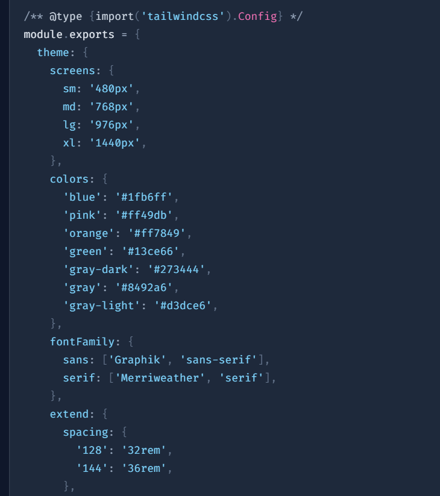
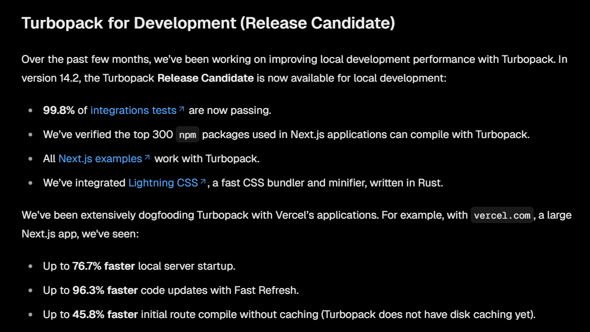

# ✨ Nova sugestão de template (beta---), Next.js 15+ com Tailwind

É um template para projetos altamente customizáveis e rápidos de montar

What is included?

- Tailwind
- TypeScript
- Husky
- Eslint
- Prettier
- Jest
- React-Testing Library

## 🧿 How to use

Use this repository as template for your project and run:

`yarn install`
or
`yarn`

To run this project use:

`yarn dev`

Lint + formatação automática:

`yarn lint-format`

To run tests use:
`yarn test`
Or to run in watch mode:
`yarn test:watch`

Or use as template when creating your new repository

### 📕 Storybook

To run storybook use: `yarn storybook`

# Motivação e vantagens - Resumo

sou apenas um trainee e gostaria muito de fazer parte do research para entender melhor como é realmente o desenvolvimento dos analistas, quais suas principais dificuldades e vantagens em usar esse template antigo. esse template reflete apenas a minha experiência prévia com dev web e isso é o q tinha em mente no geral
A criação desse template segue 3 princípios/valores:

- Agilidade (foco em desenvolvimento mais rápido)
- Sustentabilidade (atualizações a longo prazo que melhorem nossa tech stack se possível)
- Customizabilidade (mais minimalista, visa não dar um overload no template padrão do projeto)

Mudanças e possíveis desvantagens para os analistas atuais:

- Novas sintaxes e tecnologias
- Next.js pages -> app router
- Styled components -> tailwind
- novo jeito de usar svgs (material-symbols diretamente)

## Estilização e Componentes

Foi idealizada a subsituição dos styled-components por uma biblioteca chamada Tailwindcss - atualmente a ferramenta padrão do Next (14+), que utiliza classes em css para toda a estilização do projeto. Suas vantagens são:

- Classes bases (que podem ter valores alterados) que fazem o dev ficar mais rápido, incluindo pseudoclasses (hover:bg-text-black), pseudoelementos (), dark-theme (dark:text-white), tamanhos de tela (lg:w-10) e muitos outros seletores customizados
- Facilita o mobile-first por meio das classes seletoras de tamanho
- Reset css automático para maior consistência
- Adaptação de [classes para variáveis (cores, tamanhos, etc) pré-definidos](https://tailwindcss.com/docs/adding-custom-styles) na fase de concepts
  
- Criação de classes customizadas com merge de outras classes
- Funções para merge seletivo de classes (variações de componentes facilmente, twMerge)

Além dessas funções base, onde o tailwind brilha é nas ferramentas como a sua [extensão para o vscode](https://marketplace.visualstudio.com/items?itemName=bradlc.vscode-tailwindcss), onde é possível ver todas essas classes base.

## App Router (Next 15.1.3/latest)

Apesar do pages router também ser sustentado a longo termo pela Vercel, as atualizações e melhoramentos que estão sendo desenvolvidos atualmente são para o App Router. Os seus principais "pontos" são:

- Componentes e ações de servidor (+ segurança, + SEO, + velocidade de carregamento - rotas estáticas)
- Simplificar roteamento e estrutura de páginas
  \_document + \_app -> layout
- Simplificação da API
- Componentes otimizados (Form e Link - pré-renderização, Image - otimização de formatos e carregamento, Script)
- Turbopack - substituto do webpack (no caminho de se tornar para o next) feito em rust, atualmente outperforma o webpack em todos os cenários de rapidez principalmente em grandes projetos com múltiplas rotas, porém tem uma desvantagem: menos suporte (no momento) com assets estáticos (webpack brilha nisso) como o svgr, porém há planos que eles fazem em relação a isso. O terceiro ponto desse template também lida com isso
  

## Svgr -> material-symbols library

O material symbols já é uma das bibliotecas de ícones mais usadas pelos designers do NTec, e nada melhor do que já conseguir importar todos esses ícones por meio de uma fonte - mudando apenas o texto!

## Lint + Formatação
Configurei o prettier + eslint + next em um script singular, linta e formata todo o código:
`yarn lint-format`
